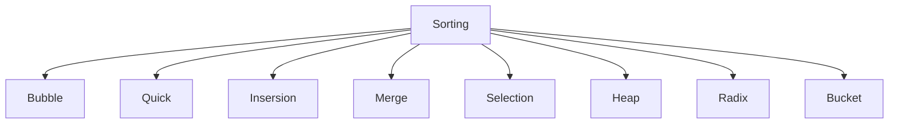
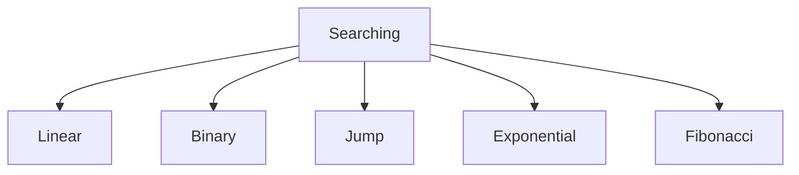
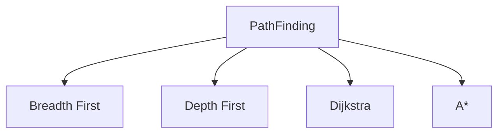

# EPQ

## Introduction


```mermaid
graph TD;
Sorting --> Bubble;
Sorting --> Quick;
Sorting --> Insersion;
Sorting --> Merge;
Sorting --> Selection;
Sorting --> Heap;
Sorting --> Radix;
Sorting --> Bucket;
```


```mermaid
graph TD;
Searching --> Linear;
Searching --> Binary;
Searching --> Jump;
Searching --> Exponential;
Searching --> Fibonacci
```


```mermaid
graph TD;
PathFinding --> bf[Breadth First];
PathFinding --> df[Depth First];
PathFinding --> Dijkstra;
PathFinding --> A*;
```

## Sorting

I started off by creating the initial file structure using the command:

```bash
create-react-app epq
```
