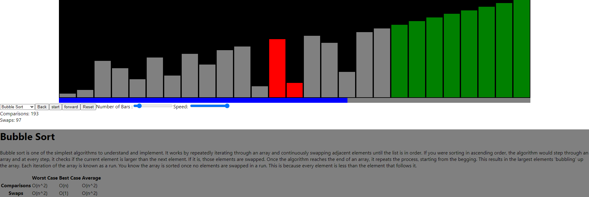

# EPQ

## Setup

To start off with, I create a typescript react app with the command `npx create-react-app artefact --template typescript`. This creates a folder called artefact containing all starting code for the project. This folder contains some boilerplate code, most of which will be removed. running the command `npm start` starts the boilerplate app, which looks like this:


The artefact folder looks like this:

```
artefact
├── node_modules
├── package.json
├── package-lock.json
├── public
├── README.md
├── src
└── tsconfig.json
```

`node_modules` contains the required modules for the project. `Public` contains the `index.html` document where the react app will be injected. And `src` is where the typescript files for the app will go.

I start off by removing all the boilerplate code from the src directory. This leaves me with four files,

```
artefact/src
├── App.css
├── App.tsx
├── index.css
└── index.tsx
```

`App.css` is empty and will be where all the component's CSS will go
`App.tsx` is the typescript file where the react components will go. Currently, it contains:

```tsx
import React from "react";
import "./App.css";

function App() {
    return <div className="App"></div>;
}

export default App;
```

This code returns an empty div element to be injected into the app.

`index.css` contains some extra CSS for index.html, currently it just contains some font styling:

```css
body {
    margin: 0;
    font-family: -apple-system, BlinkMacSystemFont, "Segoe UI", "Roboto",
        "Oxygen", "Ubuntu", "Cantarell", "Fira Sans", "Droid Sans",
        "Helvetica Neue", sans-serif;
    -webkit-font-smoothing: antialiased;
    -moz-osx-font-smoothing: grayscale;
}

code {
    font-family: source-code-pro, Menlo, Monaco, Consolas, "Courier New",
        monospace;
}
```

`index.tsx` contains code that injects the empty app element created in `App.tsx`:

```tsx
import React from "react";
import ReactDOM from "react-dom";
import "./index.css";
import App from "./App";

ReactDOM.render(
    <React.StrictMode>
        <App />
    </React.StrictMode>,
    document.getElementById("root")
);
```

## Sorting

### Basic page setup

The sorting algorithm page will contain these elements:

-   The algorithm visuliser
-   A select element to select the selected algorithm
-   Buttons to start, stop and reset the visualizer
-   Scrolling slide bars to select the number of bars to be sorted, and the sorting speed
-   A panel containing metrics on the algorithm, which will display the time taken, number of comparisons and number of swaps
-   A place to describe the selected algorithm

So to start off with, I need to create these components inside `App.tsx`. I have not decided on a final visual design for the application, so I will not style the components any more than required to get them working. Then, once I have decided on how the application will look, I will add the CSS to style the components. The file `App.css` now looks like this:

```tsx
import React from "react";
import "./App.css";

// React element for the bar container
const BarContainer = () => {
    return <div className="barContainer"></div>;
};

// React element for the Controlls
const Controlls = () => {
    return (
        <div className="controlls">
            <select className="algorithmSelect"></select>
            <button className="startstop"></button>
            <button className="reset"></button>
            <input type="range" />
            <input type="range" />
        </div>
    );
};

// React element for the Metrics
const Metrics = () => {
    return (
        <div className="metrics">
            <span>Time: </span>
            <br />
            <span>Comparisons: </span>
            <br />
            <span>Swaps: </span>
        </div>
    );
};

// react element for the Description
const Description = () => {
    return <div className="description"></div>;
};

// Base app
function App() {
    return (
        <div className="App">
            <BarContainer />
            <Controlls />
            <Metrics />
            <Description />
        </div>
    );
}

export default App;
```

'App.tsx` now contains empty components for the elements of the page. I decided to put the speed, swaps, and comparisons in their own components to make things easier later when I have to update them with their values dynamically.

Now when I run the app it looks like this:


Because there's no styling at all, it is very hard to tell what is going on. Therefore I added some basic CSS styling for the bar container inside `App.css`:

```css
.barContainer {
    width: 80vw;
    height: 20rem;
    background: black;
    margin: auto;
}
```

This, plus some added text inside the controls, makes the app now look like this:


### Adding Bars

Now to add some bars, I started by by creating an interface and functional component for the bar:

```tsx
//interface for the props passed into the bar
interface barProps {
    size: number;
    maxSize: number;
    key: number;
}
// React element for the bars
const Bar = (props: barProps) => {
    // CSS styles for bar
    var style: CSSProperties = {
        height: ((props.size / props.maxSize) * 100).toString() + "%",
    };
    return <div className="bar" style={style}></div>;
};
```

The interface declares the type of props being passed into the bar. These props are then used to determine the height of the bar. The height of a bar is represented as $\left ( \frac{Bar Size}{Max Bar Size} \times 100 \right ) $% of the bar containers height.

To create the bars, I first needed a way of creating and storing the size of each bar. I achieved this by creating a `bars` array inside the program state. This array will contain the size of each bar. I also added a variable, `numOBars`, which contains the number of bars to be visualised.

I then created a method that adds the numbers 1 -> numOBars to the bars array. This method is then run when the page loads to create the bars.

```tsx
// Base app
class App extends React.Component {
    componentDidMount() { // runs once the component has been loaded
        this.makeBars();
    }

    state = {
        numOBars: 50,
        bars: [],
    };

    // method to make the bars
    // if no parameters are entered, n is taken to be the number of bars
    makeBars = (n = this.state.numOBars) => {
        var b = [];
        for (let i = 0; i < n; i++) {
            // create an array b containing 1 -> n
            b.push(i + 1);
        }
        this.setState({ bars: b, numOBars: n }); // sets the state of bars to be b
    };
```

These state values are then passed into the barContainer component, where they are used to create the bars.

```tsx
//interface for the props passed into the bar container
interface barContainerProps {
    bars: Array<any>;
    maxSize: number;
}

// React element for the bar container
const BarContainer = (props: barContainerProps) => {
    return (
        <div className="barContainer">
            {props.bars.map(
                (
                    bar //loop through all the array, creating a bar for each element
                ) => (
                    <Bar size={bar} maxSize={props.maxSize} key={bar} />
                )
            )}
        </div>
    );
};
```

To make the bars centred and visible, I added this CSS styling

```css
.barContainer {
    width: 80vw;
    height: 20rem;
    background: black;
    margin: auto;
    display: flex;
    align-items: flex-end;
    justify-content: center;
}

.bar {
    background: gray;
    width: 5rem;
    margin: 2px;
}
```

I'm using a CSS flexbox for the bar container for two reasons. Firstly It will allow me centrally align the bars. Secondly, it will compress the elements inside of it so that they all fit. This means that all the bars will dynamically adjust their widths based on how much space is available.

The app with the bars now looks like this:


The next thing to do was to allow the number of bars to be edited by the range input created earlier. I moved the code for the `Controls` component into its own file named 'controls.tsx`. This created the codebase easier to deal with as the code is spread over multiple files.

Inside that file I added this code:

```tsx
import React from "react";
import "./App.css";

interface controlProps {
    makeBars: any;
}

// react component for the control pannel
export default class Controls extends React.Component<controlProps> {
    barSelect: React.RefObject<HTMLInputElement>;
    constructor(props: any) {
        super(props);
        this.barSelect = React.createRef(); // creates a ref which will be assigned to the bar select element
    }

    // calls the makeBars method from the app class and passes in the value of the length range
    makeBars = () => {
        this.props.makeBars(this.barSelect.current?.value);
    };

    public render() {
        return (
            <div className="controls">
                <select className="algorithmSelect">
                    <option value="">Select Algoritm</option>
                </select>
                <button className="startstop">Start</button>
                <button className="reset">Reset</button>
                Number of Bars :
                <input
                    type="range"
                    ref={this.barSelect} // linking the barSelect ref to the element
                    onChange={() => this.makeBars()} // call the `makeBars` method whenever the value of the range is changed
                />
                Speed: <input type="range" />
            </div>
        );
    }
}
```

Whenever the value of the range representing the number of bars changes, the method `MakeBars` is called, and the bars are remade.

At the moment, the bars are always created in order, which makes sorting them pretty boring as they are already in order. Therefore inside the `MakeBars` method, I added some code to shuffle the array.

```tsx
// shuffles array
for (let i = b.length - 1; i > 0; i--) {
    let j = Math.floor(Math.random() * (i + 1));
    [b[i], b[j]] = [b[j], b[i]];
}
```

Now, the bars look like this:


And the range slider can be adjusted to increase or decrease the number of bars, which can be seen here:


### Algorithm select

The way this application works will be whenever an algorithm is selected, it is run with the state of the bars being appended to the end of an array for every step. Then to display the visualisation of the algorithm, that array is iterated through, with each iteration being set as the bars' current state. I am doing it this way rather than sorting them live (changing the program state as the sorting algorithm is running) because it will allow the user to pause and then resume the visualisation with ease. It will also enable the ability to step forwards and backwards through visualisation.

To start off with, I added three things to the application state, an array containing all the algorithms available to be visualised, an array for the sorting stages, and the stage at which the visualisation is on.

```tsx
state = {
    numOBars: 50,
    bars: [],
    algorithms: [
        "Bubble Sort",
        "Quick Sort",
        "Insertion Sort",
        "Merge Sort",
        "Selection Sort",
        "Heap Sort",
        "Radix Sort",
        "Bucket Sort",
    ],
    sortingStages: [],
    sortingStage: 0,
};
```

Next, inside the Controls component, I modified the element which selects the algorithm to be used:

```tsx
<select
    className="algorithmSelect"
    onInput={() => this.algorthmSelected()}
    ref={this.algorithmSelect}
>
    <option value="">Select Algoritm</option>
    {this.props.algorithms.map((a) => (
        <option value={a} key={this.props.algorithms.indexOf(a)}>
            {a}
        </option>
    ))}
</select>
```

Now it displays an option for all the algorithms. Next, I created a new file named `algorithms.ts` which is where I will put all the functions for the algorithms. These functions will take in the bars array and return an array containing all the steps involved in sorting the bars. Then, inside the App class, I created a method to run the sorting functions. This method will be passed into the Controls class and run whenever an algorithm is selected. At the moment, it only calls for the bubble sort for testing purposes. Once the code works, I can add in the other algorithms.

```tsx
// method to run whichever sorting algorithm is selected
runAlgorithm = (selected: string) => {
    var sortingStages;
    switch (
        selected // Switch statement to select the algorithm to use
    ) {
        case "Bubble Sort":
            sortingStages = bubble(this.state.bars);
    }
    this.setState({ sortingStages: sortingStages, sortingStage: 0 }); // sets the sortingStages array inside the state to be the stages genetrated by the algorithm, also sets the sorting stage to 0
};
```

I then added the method which the algorithm select calls onInput

```tsx
// method to run whichever sorting algorithm is selected
runAlgorithm = (selected: string) => {
    var sortingStages;
    switch (
        selected // Switch statement to select the algorithm to use
    ) {
        case "Bubble Sort":
            sortingStages = bubble(this.state.bars);
    }
    this.setState({ sortingStages: sortingStages, sortingStage: 0 }); // sets the sortingStages array inside the state to be the stages genetrated by the algorithm, also sets the sorting stage to 0
};
```

### Bubble sort

#### Description

Bubble sort is one of the simplest algorithms to understand and implement. It works by repeatedly iterating through an array and continuously swapping adjacent elements until the list is in order. If you were sorting in ascending order, the algorithm would step through an array and at every step, it checks if the current element is larger than the next element. If it is, those elements are swapped. Once the algorithm reaches the end of an array, it repeats the process, starting from the begging. This results in the largest elements 'bubbling' up the array. Each iteration of the array is known as a run. You know the array is sorted once no elements are swapped in a run. This is because every element is less than the element that follows it.

#### Complexity

| Type            | **Worst case** | **Best case** | **Average** |
| --------------- | -------------- | ------------- | ----------- |
| **Comparisons** | $O(n^{2})$     | $O(n)$        | $O(n^{2})$  |
| **Swaps**       | $O(n^{2})$     | $O(1)$        | $O(n^{2})$  |

#### step by step example

A bubble sort of the array `[4, 3, 7, 2, 6]`

**First Pass:**

[**4**, **3**, 7, 2, 6] -> [**3**, **4**, 7, 2, 6] the first two elements are swapped as 3 > 4
[3, **4**, **7**, 2, 6] -> [3, **4**, **7**, 2, 6] 7 > 4 so they aren't swapped
[3, 4, **7**, **2**, 6] -> [3, 4, **2**, **7**, 6] 2 < 7 so are swapped
[3, 4, 2, **7**, **6**] -> [3, 4, 2, **6**, **7**] 6 < 7 so are swapped

**Second Pass:**

[**3**, **4**, 2, 6, 7] -> [**3**, **4**, 2, 6, 7]
[3, **4**, **2**, 6, 7] -> [3, **2**, **4**, 6, 7] 2 < 4 so are swapped
[3, 2, **4**, **6**, 7] -> [3, 2, **4**, **6**, 7]

**Third Pass:**

[**3**, **2**, 4, 6, 7] -> [**2**, **3**, 4, 6, 7] 2 < 3 so are swapped
[2, **3**, **4**, 6, 7] -> [2, **3**, **4**, 6, 7]

The array is sorted. However, the algorithm doesn't know that yet. Therefore another pass is needed.

**Forth Pass:**

[**2**, **3**, 4, 6, 7] -> [**2**, **3**, 4, 6, 7]

#### Implementation

Here is my implementation of the bubble sort algorithm:

```typescript
export const bubble = (bars: bar[]) => {
    var stages = [];
    stages.push(JSON.parse(JSON.stringify(bars))); // push first stage to array

    var swapped = true;
    for (var n = 0; n < bars.length && swapped; n++) {
        // stop once a pass has completed with no swaps
        swapped = false;
        for (var i = 0; i < bars.length - 1 - n; i++) {
            // loops through the array, with each pass one less element needs to be checked as you know is in the correct position
            if (bars[i].size > bars[i + 1].size) {
                [bars[i], bars[i + 1]] = [bars[i + 1], bars[i]]; // swaps elements
                swapped = true;
            }
            stages.push(JSON.parse(JSON.stringify(bars))); // pushes step to stages
        }
    }

    return stages;
};
```

### Select algorithm fix

Now, whenever bubble sort is selected, all the steps for bubble sort are computed and saved. An issue at the moment, though, is that if you change the number of bars or reset them, the steps are not updated. One way I could fix this is to call the algorithmSelected function every time the bars are redrawn; however, this would be very computationally heavy, so a better way to do it is this. Store a new variable named `selectedAlgoritm` inside the application state. Then add a new method inside the App class, which sets this value. That method will then be called instead of `runAlgorithm` whenever a new algorithm is selected. `runAlgorithm `will then only run when the user presses play for the first time.

```tsx
// method to set the selected algorithm
setAlgorithm = (algorithm: string) => {
    this.setState({
        selectedAlgorithm: algorithm,
        stagesGenerated: false,
        isRunning: false,
    });
};
```

```tsx
// calls the setAlgorithm method inside the app class
algorthmSelected = () => {
    this.props.setAlgorithm(this.algorithmSelect.current?.value);
};
```

### Visulisation

First, I added a new variable inside the system class named `isRunning`, which will indicate when the visualiser is running. I then passed that variable to the `Controls` class, where it is used to set what is said on the playPause button.

That button then calls a method inside the App class called `togglePlayState` onClick.

```tsx
// method to toggle the display state of the algorithm
togglePlayState = async () => {
    if (this.state.selectedAlgorithm == "") {
        alert("No algorithm selected");
    } else {
        if (!this.state.stagesGenerated) {
            // generates the stages if not generated
            await this.runAlgorithm();
        }
        await this.setState((prevState: any) => ({
            //wait for the state to be toggled
            isRunning: !prevState.isRunning,
        }));
        this.visulise();
    }
};
```

Firstly this method checks if an algorithm has been selected. If not, an alert is displayed. Then, it generates the sorting stages if they have not already been generated. Following that, it then toggles the `isRunning` variable inside the application state. I have set it to await this function because otherwise, it runs asynchronously, which will result in the variable not being toggled when the visualisation starts, causing it not to start.
I then run the visualisation method, which will visualise The selected algorithm.

```tsx
visulise = async () => {
    // checks if the visulisation is running and that there are stages left to visulise
    if (
        this.state.isRunning &&
        this.state.sortingStage < this.state.sortingStages.length
    ) {
        // sets the state to be the next stage of the sorting and increments sortingStage
        this.setState((prevState: any) => ({
            bars: prevState.sortingStages[prevState.sortingStage],
            sortingStage: prevState.sortingStage + 1,
        }));
        await pause(100); // delay
        this.visulise(); // Calls itself to keep visulising
    }
};
```

This method is recursive, which means it calls itself. It will continue to call itself until either `this.isRunning` is set to false or all the sorting stages have been visualised.

### Speed

The `pause` function pauses the operation of the visualiser for as many milliseconds that are passed in

```tsx
// function for creating a delay
const pause = (time: number) => {
    return new Promise((resolve) => setTimeout(resolve, time));
};
```

Now, when bubble sort is selected, and the start button is pressed, bubble sort will start or resume being visualised. Likewise, the visualisation is paused when the stop button is pressed. At the moment, the algorithm has a fixed delay of 100ms hardcoded into the visualise method. Now I need to make it so that the speed range slider affects the delay of the visualisation.

I did this similarly to how the bars are set. Whenever the range slider for the speed is changed, a function is called to set the `speed` variable in the program state to 1000 - range value. that is then used in the place of the hardcoded 100ms.

```tsx
// method to set the speed of the visualiser
setSpeed = (speed: number) => {
    this.setState({ speed: speed });
};
```

```tsx
// calls the setSpeed method in the App class
setSpeed = () => {
    var speed: any = this.speed.current?.value; // get value from range
    this.props.setSpeed(1000 - speed);
};
```

Now, the speed slider can change the speed at which the visualiser is displayed.

### stepping forwards and back

I added two new buttons to the Controls component, these will allow you to step forwards and backwards through the visulisaion.

```tsx
<button // Step back button
                    className="back"
                    onClick={() => this.stepBackward()}
                >
                    Back
                </button>
                <button // start stop button
                    className="startstop"
                    onClick={() => this.togglePlayState()}
                >
                    {buttonlbl}
                </button>
                <button // step forward button
                    className="forward"
                    onClick={() => this.stepForward()}
                >
                    forward
                </button>
```

They then call these methods in the app Component when clicked.

```tsx
// steps forward through the visulisation by one step
setForward = async () => {
    if (this.state.selectedAlgorithm == "") {
        // checks if algorithm is selected
        alert("No algorithm selected");
    } else {
        if (!this.state.stagesGenerated) {
            // runs algorithm is no steps are generated
            await this.runAlgorithm();
        }
        this.setState({ isRunning: false }); // sets running to false to stop the visulisation if it is running
        if (
            this.state.stagesGenerated &&
            this.state.sortingStage < this.state.sortingStages.length
        ) {
            // sets the state to be the next stage of the sorting and increments sortingStage
            this.setState((prevState: any) => ({
                bars: prevState.sortingStages[prevState.sortingStage + 1],
                sortingStage: prevState.sortingStage + 1,
            }));
        }
    }
};

// steps backwards through the visulisation by one step
setBackward = async () => {
    if (this.state.selectedAlgorithm == "") {
        // checks if algorithm is selected
        alert("No algorithm selected");
    } else {
        if (!this.state.stagesGenerated) {
            // runs algorithm is no steps are generated
            await this.runAlgorithm();
        }
        await this.setState({ isRunning: false }); // sets running to false to stop the visulisation if it is running
        if (this.state.stagesGenerated && this.state.sortingStage > 0) {
            // sets the state to be the next stage of the sorting and increments sortingStage
            this.setState((prevState: any) => ({
                bars: prevState.sortingStages[prevState.sortingStage - 1],
                sortingStage: prevState.sortingStage - 1,
            }));
        }
    }
};
```

### Colour change

Although the algorithms can now be visualised, it is hard to follow as you can only see change when swaps occur. To rectify this, I will add different colouring to the bars depending on their current state. I have not decided on the final look of the application is, so I will use temporary colours.
The different states a bar could be are :

-   Unsorted
-   Sorted
-   Selected
-   Pivot

To start with, I moved all the code for the bars into a new file named `bar.tsx`. I then added a new field into the `barProps` interface called state, which will store the state of the bar.

```tsx
// type for bar state
type barState = "unsorted" | "sorted" | "selected" | "pivot";

// Interface for the props passed into the bar
export interface barProps {
    size: number;
    maxSize: number;
    key: number;
    state: barState;
}
```

I created a custom type for the bar state, meaning the bar state can only be set to one of the four types. I then added a switch statement into the bar component to assign the colour based on the state of the bar.

```tsx
// React element for the bars
export const Bar = (props: barProps) => {
    switch (
        props.state // bar colour determined from state
    ) {
        case "unsorted":
            var col = "grey";
            break;
        case "sorted":
            var col = "green";
            break;
        case "selected":
            var col = "red";
            break;
        case "pivot":
            var col = "purple";
            break;
    }

    // CSS styles for bar
    var style: CSSProperties = {
        height: ((props.size / props.maxSize) * 100).toString() + "%",
        background: col,
    };
    return <div className="bar" style={style}></div>;
};
```

I then modified the `makeBars` method inside the App component so they when the bars are created, they are all set to unsorted. And I changed the `barContainer` component so that the bar's state is passed in as a prop.

```tsx
makeBars = (n = this.state.numOBars) => {
        var b = [];
        for (let i = 0; i < n; i++) {
            // create an array b containing 1 -> n
            b.push({ size: i + 1, state: "unsorted" });
        }
```

```tsx
// React element for the bar container
const BarContainer = (props: barContainerProps) => {
    return (
        <div className="barContainer">
            {props.bars.map(
                (
                    bar //loop through all the array, creating a bar for each
                ) => (
                    <Bar
                        size={bar.size}
                        maxSize={props.maxSize}
                        key={props.bars.indexOf(bar)}
                        state={bar.state}
                    />
                )
            )}
        </div>
    );
};
```

Now that the visualiser can display the different states of the bars, the next step was to modify the bubble sort function so that the states are updated. So that the states can be displayed more accurately, the sorting steps will have to be updated more frequently. This will result in the visualiser being slower on average due to there being more steps. However, this reduced speed is essential for showing the algorithm in more detail.

```tsx
xport const bubble = (bars: barProps[]) => {
    var stages = [];
    stages.push(JSON.parse(JSON.stringify(bars))); // push first stage to array

    var swapped = true;
    for (var n = 0; n < bars.length && swapped; n++) {
        // stop once a pass has completed with no swaps
        swapped = false;
        for (var i = 0; i < bars.length - 1 - n; i++) {
            // loops through the array, with each pass one less element needs to be checked as you know is in the correct position

            // sets current bars' state
            bars[i].state = "selected";
            bars[i + 1].state = "selected";

            if (bars[i].size > bars[i + 1].size) {
                stages.push(JSON.parse(JSON.stringify(bars))); // pushes step to stages

                [bars[i], bars[i + 1]] = [bars[i + 1], bars[i]]; // swaps elements
                swapped = true;
            }
            stages.push(JSON.parse(JSON.stringify(bars))); // pushes step to stages

            // sets bars back to unsorted
            bars[i].state = "unsorted";
            bars[i + 1].state = "unsorted";
        }
        bars[bars.length - n - 1].state = "sorted"; // sets the last bar to sorted
        stages.push(JSON.parse(JSON.stringify(bars))); // pushes step to stages

        // once no swaps have been made, all the remaining bars are looped through and set to sorted
        if (!swapped) {
            for (var i = 0; i < bars.length - 1 - n; i++) {
                bars[i].state = "sorted";
                stages.push(JSON.parse(JSON.stringify(bars))); // pushes step to stages
            }
        }
    }

    return stages;
};
```

Now, the visualiser can display a visualisation of the selected algorithm with the colouring of the bars. Here is an example of the bars mid-sort:


### Swaps and comparisons

Originally I intended to record and display the number of swaps, comparisons, and time taken whist the algorithms are running. However, showing the time will no longer work due to the added ability to step forwards and backwards. Different devices would run at different speeds anyway, so the time would not be consistent. Therefore, I will only display the number of swaps and comparisons made.

First, I modified `algorithms.ts` to record the number of comparisons and swaps taken. Then instead of only the stages of the bars, it now saves the swaps and comparisons too.

```typescript
interface stage {
    bars: barProps[];
    comparisons: number;
    swaps: number;
}

export const bubble = (bars: barProps[]) => {
    var stages: stage[] = [];
    var comparisons = 0;
    var swaps = 0;
    stages.push({
        bars: JSON.parse(JSON.stringify(bars)),
        swaps: swaps,
        comparisons: comparisons,
    }); // push first stage to array

    var swapped = true;
    for (var n = 0; n < bars.length && swapped; n++) {
        // stop once a pass has completed with no swaps
        swapped = false;
        for (var i = 0; i < bars.length - 1 - n; i++) {
            // loops through the array, with each pass one less element needs to be checked as you know is in the correct position

            // sets current bars' state
            bars[i].state = "selected";
            bars[i + 1].state = "selected";

            comparisons++;

            if (bars[i].size > bars[i + 1].size) {
                stages.push({
                    bars: JSON.parse(JSON.stringify(bars)),
                    swaps: swaps,
                    comparisons: comparisons,
                }); // pushes step to stages

                [bars[i], bars[i + 1]] = [bars[i + 1], bars[i]]; // swaps elements
                swapped = true;
                swaps++;
            }
            stages.push({
                bars: JSON.parse(JSON.stringify(bars)),
                swaps: swaps,
                comparisons: comparisons,
            }); // pushes step to stages

            // sets bars back to unsorted
            bars[i].state = "unsorted";
            bars[i + 1].state = "unsorted";
        }
        bars[bars.length - n - 1].state = "sorted"; // sets the last bar to sorted
        stages.push({
            bars: JSON.parse(JSON.stringify(bars)),
            swaps: swaps,
            comparisons: comparisons,
        }); // pushes step to stages

        // once no swaps have been made, all the remaining bars are looped through and set to sorted
        if (!swapped) {
            for (var i = 0; i < bars.length - 1 - n; i++) {
                bars[i].state = "sorted";
                stages.push({
                    bars: JSON.parse(JSON.stringify(bars)),
                    swaps: swaps,
                    comparisons: comparisons,
                }); // pushes step to stages
            }
        }
    }

    return stages;
};
```

SortingStages is now an array of interfaces containing the bars, swaps, and comparisons for each stage. The code for stepping through the stages needs to be modified to take all the stage parts and add them to the application state. Here is an example of the revised code from the `visualise` method:

```tsx
this.setState((prevState: any) => ({
    bars: prevState.sortingStages[prevState.sortingStage + 1].bars,
    swaps: prevState.sortingStages[prevState.sortingStage + 1].swaps,
    comparisons:
        prevState.sortingStages[prevState.sortingStage + 1].comparisons,
    sortingStage: prevState.sortingStage + 1,
}));
```

Using those new state values, I then passed them into the `Metrics` component to display them and removed the speed indicator.

```tsx
// interface for the props passed into the metrics element
interface metricsProps {
    swaps: number;
    comparisons: number;
}

// React element for the Metrics
const Metrics = (props: metricsProps) => {
    return (
        <div className="metrics">
            <span>Comparisons: {props.comparisons}</span>
            <br />
            <span>Swaps: {props.swaps}</span>
        </div>
    );
};
```

Now, the number of swaps and comparisons carried out are shown under the visualiser.


### Type cleanup

So far, I have placed any types and interfaces above where they are needed. This worked fine; however, once these types started to be needed across multiple files, it has become challenging to manage. Therefore I have placed all these types and interfaces inside a new file named `types.ts`.

```typescript
// types for the stage
export interface stage {
    bars: bar[];
    comparisons: number;
    swaps: number;
}

// props passed into the description
export interface descriptionProps {
    selectedAlgorithm: string;
}

// Types for the props passed into the control component
export interface controlProps {
    makeBars: (n: any) => void;
    setAlgorithm: (selection: any) => void;
    togglePlayState: () => void;
    setSpeed: (speed: any) => void;
    stepForward: () => void;
    stepBackward: () => void;
    isRunning: boolean;
    algorithms: string[];
}

//interface for the props passed into the bar container
export interface barContainerProps {
    bars: Array<any>;
    maxSize: number;
}

// interface for the props passed into the metrics element
export interface metricsProps {
    swaps: number;
    comparisons: number;
}

// types for the application state
export interface appState {
    numOBars: number;
    bars: bar[];
    algorithms: string[];
    isRunning: boolean;
    sortingStages: stage[];
    sortingStage: number;
    selectedAlgorithm: string;
    stagesGenerated: boolean;
    speed: number;
    comparisons: number;
    swaps: number;
}

// type for bar state
export type barState = "unsorted" | "sorted" | "selected" | "pivot";

export interface bar {
    size: number;
    state: barState;
}

// Interface for the props passed into the bar
export interface barProps {
    size: number;
    maxSize: number;
    key: number;
    state: barState;
}
```

Now, whenever I want to use a type or interface, I can import it at the top of the file.

### Algorithm Description

Next, I need to add the description of the selected algorithm. This description will only be shown when an algorithm is selected.

I started by creating a new file named `description.tsx` where I placed this code.

```tsx
export default class Description extends React.Component<descriptionProps> {
    render() {
        var style: CSSProperties = {}; // css properties
        var info = {
            // sets info to be blank
            title: "",
            text: "",
            complexity: {
                comparisons: {
                    worst: "",
                    best: "",
                    average: "",
                },
                swaps: {
                    worst: "",
                    best: "",
                    average: "",
                },
            },
        };

        switch (this.props.selectedAlgorithm) {
            case "": // if no algorithm is selected don't display
                style.display = "none";
                break;

            case "Bubble Sort":
                info = {
                    title: "Bubble Sort",
                    text: "Bubble sort is one of the simplest algorithms to understand and implement. It works by repeatedly iterating through an array and continuously swapping adjacent elements until the list is in order. If you were sorting in ascending order, the algorithm would step through an array and at every step, it checks if the current element is larger than the next element. If it is, those elements are swapped. Once the algorithm reaches the end of an array, it repeats the process, starting from the begging. This results in the largest elements 'bubbling' up the array. Each iteration of the array is known as a run. You know the array is sorted once no elements are swapped in a run. This is because every element is less than the element that follows it.",
                    complexity: {
                        comparisons: {
                            worst: "O(n^2)",
                            best: "O(n)",
                            average: "O(n^2)",
                        },
                        swaps: {
                            worst: "O(n^2)",
                            best: "O(1)",
                            average: "O(n^2)",
                        },
                    },
                };
                break;
        }

        return (
            <div className="description" style={style}>
                <h1>{info.title}</h1>
                <p>{info.text}</p>
                {/* table to show complexity */}
                <table>
                    <tr>
                        <th></th>
                        <th>Worst Case</th>
                        <th>Best Case</th>
                        <th>Average</th>
                    </tr>
                    <tr>
                        <th>Comparisons</th>
                        <td>{info.complexity.comparisons.worst}</td>
                        <td>{info.complexity.comparisons.best}</td>
                        <td>{info.complexity.comparisons.average}</td>
                    </tr>
                    <tr>
                        <th>Swaps</th>
                        <td>{info.complexity.swaps.worst}</td>
                        <td>{info.complexity.swaps.best}</td>
                        <td>{info.complexity.swaps.average}</td>
                    </tr>
                </table>
            </div>
        );
    }
}
```

As I am still undecided on the website's visual design, I have left the styling of the description. Once I have decided on how I want the website to look, I will style it. I have also only put in the description for bubble sort as it is the only one I have implemented so far.

Now, the visualiser looks like this:


### Progress bar

Alongside the step forward and backwards buttons, I have also decided to add a progress bar for displaying the progress of the visualisation. This will be done using two divs, one outer and one inner. The height of the inner one will be set to 100% of the outer one, and its width will be set to $\left ( \frac{Current Step}{Number of steps} \times 100 \right )%$ of the outer one. here is the code:

```tsx
// component for the progress bar of the visuliser
export default class ProgressBar extends React.Component<progressBarProps> {
    render() {
        var style: CSSProperties = {
            width:
                ((this.props.stage / (this.props.max - 1)) * 100).toString() +
                "%", // sets width proportional to how far it is into the visuliation
        };
        return (
            <div className="outerProgressBar">
                <div className="innerProgressBar" style={style}></div>
            </div>
        );
    }
}
```

and this is the subsequent CSS

```css
.outerProgressBar {
    width: 80vw;
    height: 1rem;
    background: grey;
    margin: auto;
}

.innerProgressBar {
    height: 100%;
    background: blue;
}
```

Here is how the visuliser now looks:



### Component cleanup

I was unhappy with how large the `Controls` component had become. Therefore, I reduced it down to many smaller components. This will allow easier code maintenance and more freedom as to how I arrange them on the screen. It will also make it easier to reuse any of them for the other two visualisers. I created the new files: `algorithmSelector.tsx`, `backButton.tsx`, `startStopButton.tsx`, `forwardButon.tsx`, `resetButton.tsx`, `numOBarsSelector.tsx`, and `speedSelector.tsx`. Which contain respectively:

```tsx
export default class AlgoritmSelector extends React.Component<algoritmSelectorProps> {
    ref: React.RefObject<HTMLSelectElement>;

    constructor(props: algoritmSelectorProps) {
        super(props);
        this.ref = React.createRef();
    }

    // calls the setAlgorithm method inside the app class
    algorthmSelected = () => {
        this.props.setAlgorithm(this.ref.current?.value);
    };

    render() {
        return (
            <select // Algorithm selector
                className="algorithmSelect"
                onInput={() => this.algorthmSelected()}
                ref={this.ref}
            >
                <option value="">Select Algoritm</option>
                {this.props.algorithms.map((a) => (
                    <option value={a} key={this.props.algorithms.indexOf(a)}>
                        {a}
                    </option>
                ))}
            </select>
        );
    }
}
```

```tsx
export default class BackButton extends React.Component<stepBackwardsProps> {
    // calls the stepBackward method in the App class
    stepBackward = () => {
        this.props.stepBackward();
    };

    render() {
        return (
            <button className="backButton" onClick={() => this.stepBackward()}>
                back
            </button>
        );
    }
}
```

```tsx
export default class StartStopButton extends React.Component<startStopProps> {
    // calls the togglePlayState method in the App class
    togglePlayState = () => {
        this.props.togglePlayState();
    };

    render() {
        var buttonlbl: string;
        if (this.props.isRunning) {
            buttonlbl = "stop";
        } else {
            buttonlbl = "start";
        }
        return (
            <button // start stop button
                className="startstop"
                onClick={() => this.togglePlayState()}
            >
                {buttonlbl}
            </button>
        );
    }
}
```

```tsx
export default class ForwardButton extends React.Component<stepForwardProps> {
    // calls the stepForward method in the App class
    stepForward = () => {
        this.props.stepForward();
    };

    render() {
        return (
            <button // step forward button
                className="forward"
                onClick={() => this.stepForward()}
            >
                forward
            </button>
        );
    }
}
```

```tsx
export default class ResetButton extends React.Component<resetButtonProps> {
    reset = () => {
        this.props.reset();
    };

    render() {
        return (
            <button // reset button
                className="reset"
                onClick={() => this.reset()}
            >
                Reset
            </button>
        );
    }
}
```

```tsx
export default class NumOBarsSelector extends React.Component<numOBarsSelectorProps> {
    ref: React.RefObject<HTMLInputElement>;

    constructor(props: numOBarsSelectorProps) {
        super(props);
        this.ref = React.createRef();
    }

    // calls the makeBars method from the app class and passes in the value of the length range
    makeBars = () => {
        this.props.makeBars(this.ref.current?.value);
    };

    render() {
        return (
            <div>
                Number of Bars :
                <input // bat range
                    type="range"
                    ref={this.ref} // linking the barSelect ref to the element
                    onChange={() => this.makeBars()} // call the `makeBars` method whenever the value of the range is changed
                    min={5}
                    max={200}
                />
            </div>
        );
    }
}
```

I then moved the `BarContainer` and `Metrics` components into their own files. After that, I re-named the `App` component and file to be `Sorting`. I then made some blank components for the home, searching and pathfinding pages. All of the files containing components were then moved into a new file named `components`. This is now what the folder structure of my src folder is like:

```
src
├── App.css
├── algorithms.ts
├── components
│   ├── Home.tsx
│   ├── Pathfinding.tsx
│   ├── Searching.tsx
│   ├── Sorting.tsx
│   ├── algoritmSelector.tsx
│   ├── backButton.tsx
│   ├── bar.tsx
│   ├── barContainer.tsx
│   ├── description.tsx
│   ├── forwardButton.tsx
│   ├── metrics.tsx
│   ├── numOBarsSelector.tsx
│   ├── progressBar.tsx
│   ├── resetButton.tsx
│   ├── speedSelector.tsx
│   └── startStopButton.tsx
├── index.css
├── index.tsx
├── react-app-env.d.ts
└── types.ts
```

### Routing

So far, my application has only been one page. However, For the final product, it will require multiple pages. I will achieve this using the `react-router-dom` module. This was then used to set up multiple routes for the application, With each one linking to the relevant component. This was all done inside the `index.tsx` file, which now looks like this:

```tsx
import React from "react";
import ReactDOM from "react-dom";
import "./index.css";
import Sorting from "./components/Sorting";
import { Route, Link, BrowserRouter as Router } from "react-router-dom";
import Home from "./components/Home";
import Searching from "./components/Searching";
import Pathfinding from "./components/Pathfinding";

ReactDOM.render(
    <React.StrictMode>
        <Router>
            <Route exact path="/">
                <Home></Home>
            </Route>
            <Route path="/sorting">
                <Sorting></Sorting>
            </Route>
            <Route path="/searching">
                <Searching></Searching>
            </Route>
            <Route path="/pathfinding">
                <Pathfinding></Pathfinding>
            </Route>
        </Router>
    </React.StrictMode>,
    document.getElementById("root")
);
```

### Further file management

To increase the ease of development, I subdivided my `components` folder into more folders to store the different components. There is a folder for each of the respective visualisers and folders to contain the controls, navigation, and info components. The file structure now looks like this:

```
src
├── algorithms.ts
├── App.css
├── components
│   ├── controlls
│   │   ├── algoritmSelector.tsx
│   │   ├── backButton.tsx
│   │   ├── forwardButton.tsx
│   │   ├── numOBarsSelector.tsx
│   │   ├── resetButton.tsx
│   │   ├── speedSelector.tsx
│   │   └── startStopButton.tsx
│   ├── Home.tsx
│   ├── info
│   │   ├── description.tsx
│   │   └── metrics.tsx
│   ├── navigation
│   ├── pathfinding
│   │   └── Pathfinding.tsx
│   ├── searching
│   │   └── Searching.tsx
│   └── sorting
│       ├── barContainer.tsx
│       ├── bar.tsx
│       ├── progressBar.tsx
│       └── Sorting.tsx
├── index.css
├── index.tsx
├── react-app-env.d.ts
└── types.ts
```

### Navigation UI

Now that all the parts of the sorting visualiser have been created, it is time for visual styling. For the colour scheme, I have decided to use the [Nord](https://www.nordtheme.com/) pallet. Therefore, to start with, I need to define the colours. I created a file named `colours.css` which contains:

```css
:root {
    --nord0: #2e3440;
    --nord1: #3b4252;
    --nord2: #434c5e;
    --nord3: #4c566a;
    --nord4: #d8dee9;
    --nord5: #e5e9f0;
    --nord6: #eceff4;
    --nord7: #8fbcbb;
    --nord8: #8fbcbb;
    --nord9: #88c0d0;
    --nord10: #81a1c1;
    --nord11: #bf616a;
    --nord12: #d08770;
    --nord13: #ebcb8b;
    --nord14: #a3be8c;
    --nord15: #b48ead;
    --nord16: #242933;
}
```

These colours can now be imported into any other CSS file in the project.

### Navigation bar

A navigation bar, often referred to as a navbar, is used in applications to switch between pages. I have drawn up a plan of how the navbar will look:


The navbar will be made up of three components: one for the navbar itself, one for the label of the website's name, and one for the links to each of the pages to the applications. For the icons in the navbar, I will be using (Font Awsome)[https://fontawesome.com/].

First, I created three new files: `navBar.tsx`, `navLink.tsx`, `navTitle.tsx`, and `navBar.css`. `navBar.tsx` contains the NavBar component, which contains two `navParts`, one for the title and one for the links. They are grouped this way so that they can be responsively spaced out based on the screen size. Each NavLink is passed in five properties, the icon to show, the text to show,if it links to the current page, where to link to, and how much to rotate the icon. The icon rotation is required as the logo for sorting needs to be rotated.

Here is the code inside `navBar.tsx`:

```tsx
import React from "react";
import "./navBar.css";
import NavLink from "./navLink";
import NavTitle from "./navTitle";
import {
    faHome,
    faSortAmountDownAlt,
    faSearch,
    faRoute,
} from "@fortawesome/free-solid-svg-icons";
import { navBarProps } from "../../types";

// component for the nav bar
export default class NavBar extends React.Component<navBarProps> {
    render() {
        return (
            <nav className="navBar">
                <div className="navPart">
                    <NavTitle />
                </div>
                {/* links are wrapped inside a container div so that they are kept together */}
                <div className="navPart">
                    <NavLink
                        icon={faHome}
                        text="Home"
                        current={this.props.page == "home"}
                        linkTo=""
                    ></NavLink>
                    <NavLink
                        icon={faSortAmountDownAlt}
                        text="Sorting"
                        current={this.props.page == "sorting"}
                        iconRotation={270}
                        linkTo="sorting"
                    ></NavLink>
                    <NavLink
                        icon={faSearch}
                        text="Searching"
                        current={this.props.page == "searching"}
                        linkTo="searching"
                    ></NavLink>
                    <NavLink
                        icon={faRoute}
                        text="Pathfinding"
                        current={this.props.page == "pathfinding"}
                        linkTo="pathfinding"
                    ></NavLink>
                </div>
            </nav>
        );
    }
}
```

`navLink.tsx`:

```tsx
import React from "react";
import "./navBar.css";
import { Link } from "react-router-dom";
import { navLinkProps } from "../../types";
import { FontAwesomeIcon } from "@fortawesome/react-fontawesome";

// component for the navbar links

export default class NavLink extends React.Component<navLinkProps> {
    render() {
        var extraclass = "";
        if (this.props.current) {
            // if link set to current, the selected class will be assigned to it, this gives it a diferent text colour and background
            extraclass = "selected";
        }
        return (
            <Link
                to={this.props.linkTo}
                className={"navItem navLink " + extraclass}
            >
                <FontAwesomeIcon
                    icon={this.props.icon}
                    rotation={this.props.iconRotation}
                    className="icon"
                />

                {this.props.text}
            </Link>
        );
    }
}
```

`navTitle.tsx`:

```tsx
import React from "react";
import "./navBar.css";

// component for the navbar title
export default class NavTitle extends React.Component {
    render() {
        return <div className="navItem navTitle">Algorithm Visuliser</div>;
    }
}
```

and `navBar.css`

```css
@import "../../colours.css";

.navBar {
    width: 100vw;
    height: 4rem;
    background: var(--nord0);
    display: flex;
    flex-direction: row;
    align-items: center;
    justify-content: space-evenly;
}

.navPart {
    height: 100%;
    display: flex;
    flex-direction: row;
    align-items: center;
    justify-content: inherit;
}

.navItem {
    color: var(--nord4);
    height: 70%;
    padding-left: 1rem;
    padding-right: 1rem;
    margin-left: 0.1rem;
    margin-right: 0.1rem;
    display: flex;
    flex-direction: row;
    align-items: center;
    justify-content: space-between;
    border-radius: 20rem;
}

.navLink {
    text-decoration: none;
    transition: background 200ms;
}

.navLink:hover {
    background: var(--nord2);
}

.selected {
    background: var(--nord1);
    color: var(--nord9);
}

.navTitle {
    margin-right: auto;
    font-size: 1.5rem;
}

.icon {
    padding-right: 0.5rem;
}
```

I have inserted it before each page in the browser router inside `index.tsx` to display the navbar:

```tsx
ReactDOM.render(
    <React.StrictMode>
        <Router>
            <Route exact path="/">
                <NavBar page="home" />
                <Home />
            </Route>
            <Route path="/sorting">
                <NavBar page="sorting" />
                <Sorting />
            </Route>
            <Route path="/searching">
                <NavBar page="searching" />
                <Searching />
            </Route>
            <Route path="/pathfinding">
                <NavBar page="pathfinding" />
                <Pathfinding />
            </Route>
        </Router>
    </React.StrictMode>,
    document.getElementById("root")
);
```

All of that put together now makes the sorting page look like this:


### Mobile Navbar

Although I have already made the navbar for this application, the issue with it is that it does not work on mobile devices. Here is an example using the chrome developer tools in order to simulate a mobile device:


Websites fix this scaling issue by replacing the navigation buttons with a dropdown menu once the screen reaches a specific size.

To start off with, I created a new file named `navWaffle.tsx`, where I will store the code for the dropdown button. when this button is clicked, it will toggle a variable named `menuActive` inside the state of the navbar. Here is the code for the button and the modified code in the navbar:

```tsx
import React from "react";
import { FontAwesomeIcon } from "@fortawesome/react-fontawesome";
import { faBars } from "@fortawesome/free-solid-svg-icons";
import { waffleProps } from "../../types";

export default class NavWaffle extends React.Component<waffleProps> {
    toggleMenu = () => {
        this.props.toggleMenu();
    };

    render() {
        return (
            <button className="waffle" onClick={() => this.toggleMenu()}>
                <FontAwesomeIcon icon={faBars} size="2x" />
            </button>
        );
    }
}
```

```tsx
/ component for the nav bar
export default class NavBar extends React.Component<navBarProps, navBarState> {
    state = {
        menuActive: false,
    };

    toggleMenu = () => {
        console.log("test");
        this.setState((prevstate) => ({
            menuActive: !prevstate.menuActive,
        }));
    };

    render() {
        return (
            <nav className="navBar">
                <div className="navPart">
                    <NavTitle />
                </div>
                {/* links are wrapped inside a container div so that they are kept together */}
                <div className="navPart">
                    <NavLink
                        icon={faHome}
                        text="Home"
                        current={this.props.page == "home"}
                        linkTo=""
                    ></NavLink>
                    <NavLink
                        icon={faSortAmountDownAlt}
                        text="Sorting"
                        current={this.props.page == "sorting"}
                        iconRotation={270}
                        linkTo="sorting"
                    ></NavLink>
                    <NavLink
                        icon={faSearch}
                        text="Searching"
                        current={this.props.page == "searching"}
                        linkTo="searching"
                    ></NavLink>
                    <NavLink
                        icon={faRoute}
                        text="Pathfinding"
                        current={this.props.page == "pathfinding"}
                        linkTo="pathfinding"
                    ></NavLink>
                </div>
                <NavWaffle toggleMenu={this.toggleMenu} />
            </nav>
        );
    }
}
```

Next, I need to show a dropdown once the button is pressed. This is achieved inside `navDropdown.tsx`, where it only shows when `menuActive` is set to true. here is the code for the dropdown component:

```tsx
import React from "react";
import {
    faHome,
    faSortAmountDownAlt,
    faSearch,
    faRoute,
} from "@fortawesome/free-solid-svg-icons";
import NavDropdownLink from "./navDropdownLink";
import { navDropdownProps } from "../../types";

export default class NavDropdown extends React.Component<navDropdownProps> {
    render() {
        var extraClass = "dropdownHidden";
        if (this.props.menuActive) {
            extraClass = "dropdownShow";
        }
        return (
            <div className={"navDropdown " + extraClass}>
                <NavDropdownLink
                    icon={faHome}
                    text="Home"
                    current={this.props.page == "home"}
                    linkTo=""
                ></NavDropdownLink>
                <NavDropdownLink
                    icon={faSortAmountDownAlt}
                    text="Sorting"
                    current={this.props.page == "sorting"}
                    iconRotation={270}
                    linkTo="sorting"
                ></NavDropdownLink>
                <NavDropdownLink
                    icon={faSearch}
                    text="Searching"
                    current={this.props.page == "searching"}
                    linkTo="searching"
                ></NavDropdownLink>
                <NavDropdownLink
                    icon={faRoute}
                    text="Pathfinding"
                    current={this.props.page == "pathfinding"}
                    linkTo="pathfinding"
                ></NavDropdownLink>
            </div>
        );
    }
}
```

and here is the code for the `NavDropdownLink` inside `navDropdownLink.tsx`:

```tsx
import React from "react";
import "./navBar.css";
import { Link } from "react-router-dom";
import { navDropdownLinkProps } from "../../types";
import { FontAwesomeIcon } from "@fortawesome/react-fontawesome";

// component for the navbar links

export default class NavDropdownLink extends React.Component<navDropdownLinkProps> {
    render() {
        var extraclass = "dropdownLinkUnselected";
        if (this.props.current) {
            // if link set to current, the selected class will be assigned to it, this gives it a diferent text colour and background
            extraclass = "dropdownLinkSelected";
        }
        return (
            <Link
                to={this.props.linkTo}
                className={"navDropdownLink " + extraclass}
            >
                <FontAwesomeIcon
                    icon={this.props.icon}
                    rotation={this.props.iconRotation}
                    className="icon"
                />

                {this.props.text}
            </Link>
        );
    }
}
```

finally, the CSS styling for the dropdown:

```css
.waffle {
    color: var(--nord4);
    padding: 0.5rem;
    background: none;
    border: none;
    outline: none;
    border-radius: 0.5rem;
    cursor: pointer;
    display: none;
}

.waffle:hover {
    background: var(--nord2);
}

.navDropdown {
    height: 50%;
    padding-bottom: 100%;
    width: 100vw;
    z-index: 100;
    margin-top: 4rem;
    background: var(--nord0);
    position: fixed;
    top: 0;
    display: flex;
    flex-direction: column;
    align-items: center;
    justify-content: space-around;
    transition: 0.5s;
    overflow: hidden;
}

.navDropdownLink {
    text-decoration: none;
    font-size: 150%;
    padding: 1rem;
    background: var(--nord16);
    border-radius: 10rem;
}

.dropdownHidden {
    height: 0;
    padding: 0;
}

.dropdownLinkUnselected {
    color: var(--nord4);
}

.dropdownLinkSelected {
    color: var(--nord9);
}

@media screen and (max-width: 768px) {
    .waffle {
        display: inline;
    }
    .navLink {
        display: none;
    }
}
```

By default, the waffle button is disabled. However, once the device width is less than 768px (mobile size), the navbar links are hidden, and the waffle button is shown. This is what the application now looks like on a mobile device, with the dropdown menu active.


